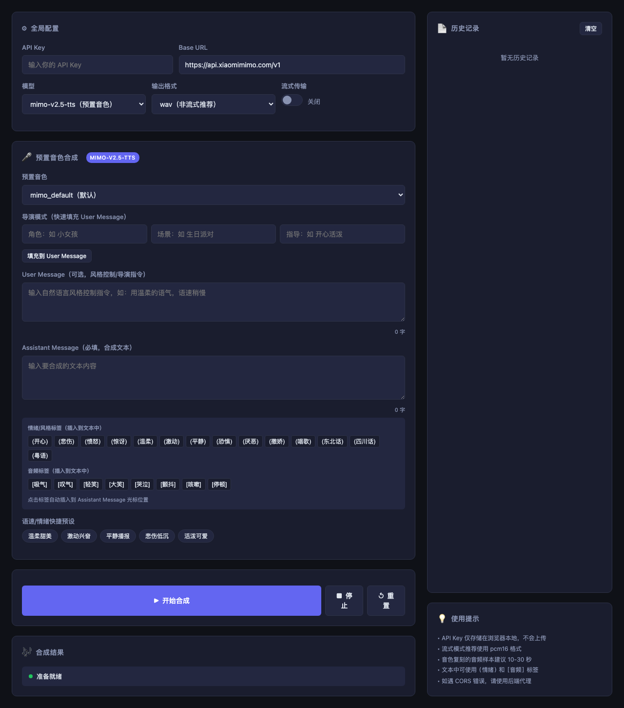
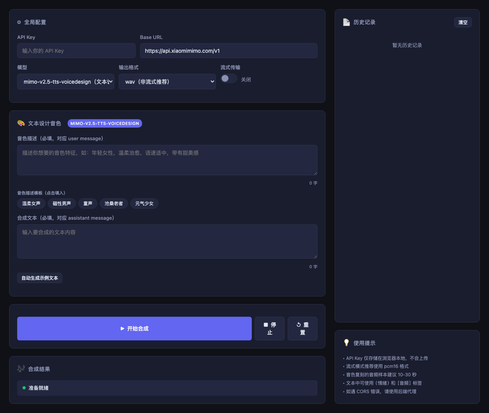
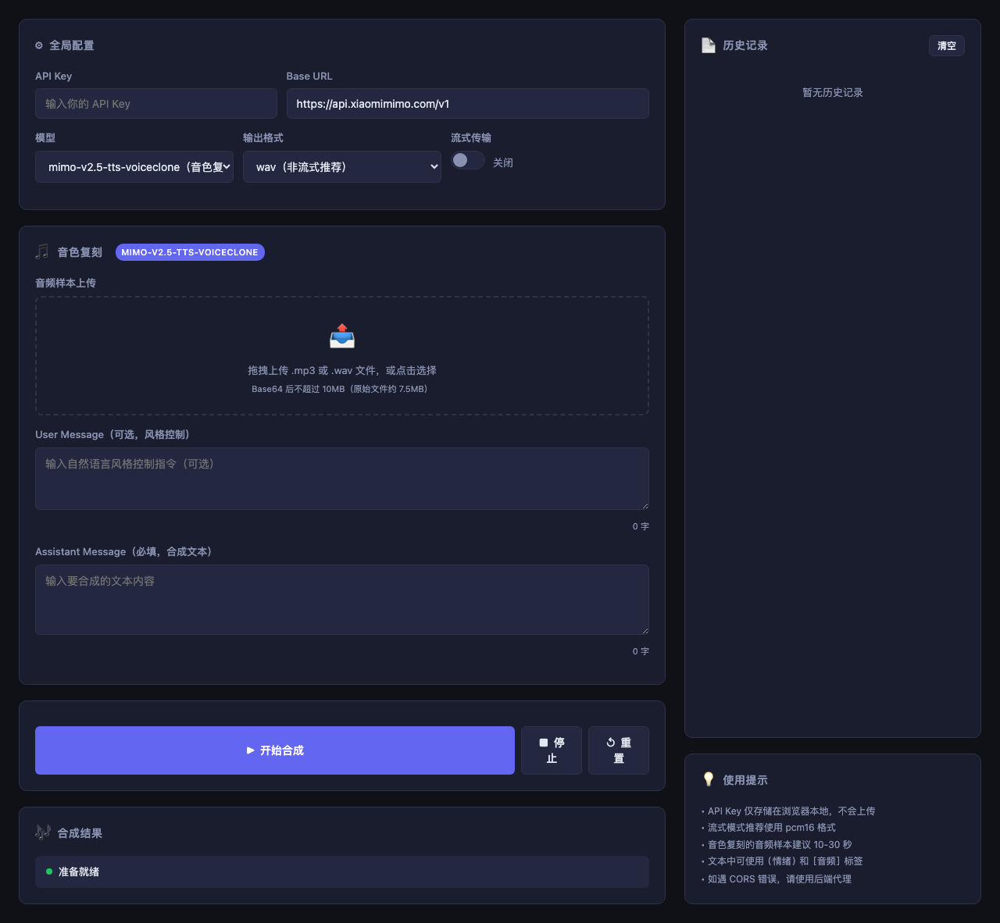

# MiMo TTS Web

基于小米 MiMo-V2.5-TTS 系列 API 的语音合成网页应用。

## 功能特性

- 支持三种模型：预置音色、文本设计音色、音色复刻
- 流式/非流式合成
- 导演模式、情绪标签、快捷预设
- 音频可视化
- 历史记录

## 功能截图

### 模型 A：预置音色（mimo-v2.5-tts）

选择预置音色，支持导演模式、情绪/音频标签插入、快捷预设。



### 模型 B：文本设计音色（mimo-v2.5-tts-voicedesign）

通过文字描述音色特征，自由设计个性化音色。



### 模型 C：音色复刻（mimo-v2.5-tts-voiceclone）

上传音频样本，复刻目标音色进行语音合成。



## 快速开始

### 方式一：直接打开（需配置 CORS 或使用代理）

```bash
# 直接在浏览器打开 index.html
open index.html
```

> 注意：直接打开浏览器会遇到 CORS 限制，建议使用方式二。

### 方式二：使用 Node.js 代理服务器

```bash
# 安装依赖
npm install

# 启动服务器
npm start

# 打开浏览器
open http://localhost:3000
```

## 文件结构

```
mimo-tts-web/
├── index.html      # 主页面（单文件 SPA）
├── server.js       # Node.js 代理服务器
├── package.json    # 依赖配置
└── README.md       # 说明文档
```

## API 使用说明

- **API Key**：在页面顶部输入框填写，仅存储在浏览器 localStorage
- **Base URL**：`https://api.xiaomimimo.com/v1`
- **端点**：`POST /v1/chat/completions`

### 请求格式

```json
{
  "model": "mimo-v2.5-tts",
  "messages": [
    { "role": "user", "content": "风格控制指令" },
    { "role": "assistant", "content": "要合成的文本" }
  ],
  "audio": {
    "format": "wav",
    "voice": "预置音色ID 或 base64音频"
  },
  "stream": false
}
```

## 浏览器兼容性

- Chrome 90+
- Firefox 88+
- Safari 14+
- Edge 90+
